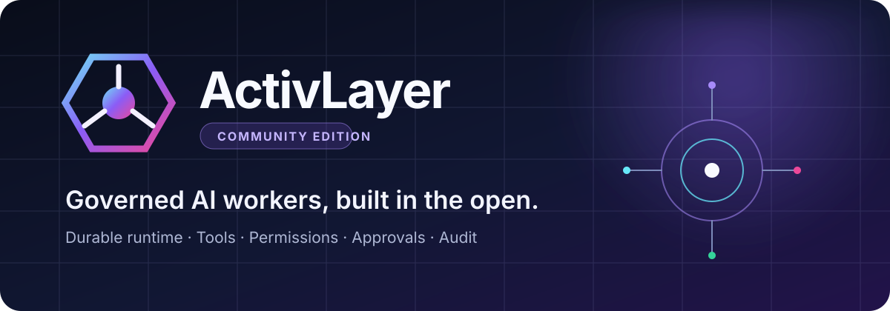

<div align="center">
  <a href="https://www.activlayer.com/">
    
  </a>
</div>

<div align="center">

[](COMMUNITY.md)
[](pyproject.toml)
[](LICENSE)
[](https://github.com/ActivLayer/activlayer/actions)

**The open framework for building and operating governed AI workers.**

[Website](https://www.activlayer.com/) · [Documentation](https://www.activlayer.com/documentation/) · [Articles](https://www.activlayer.com/articles/) · [CLI guide](docs/cli.md) · [Community](COMMUNITY.md)

</div>

---

ActivLayer Community Edition is an operational, self-hosted environment for one organization and up
to three users. Define workers and multi-worker orchestrators as portable Studio-compatible JSON
graphs, edit them from a rich terminal interface or safe design chat, connect local or remote
models, publish versioned definitions, and execute them with durable state, isolated worker memory,
shared knowledge, permissions, approval checkpoints, retries, and tamper-evident events.

It has no required cloud account, mandatory telemetry, or proprietary service in the execution path.

## What is included

| Environment | Agent design | Execution | Integration |
|---|---|---|---|
| One organization | Worker + orchestrator types | Durable SQLite state | Ollama |
| Up to three users | Studio-compatible JSON + design chat | Permission enforcement | vLLM |
| Token-authenticated API | Node and property editing | Human approval gates | llama.cpp server |
| Isolated worker memory | Draft and publish lifecycle | Retries and resume | Any OpenAI-compatible API |
| Shared knowledge base | Import and export | Hash-chained events | Governed HTTP connectors |

## Install

Linux and macOS:

```bash
curl -fsSL https://raw.githubusercontent.com/ActivLayer/activlayer/community-edition/install.sh | sh
```

Then use the single `activlayer` command from any directory:

```bash
activlayer --help
activlayer init --organization "Example Organization"
```

The installer requires Python 3.11 or newer, creates an isolated environment under
`~/.local/share/activlayer`, and exposes only `activlayer` through `~/.local/bin`. Running the same
install command upgrades the existing installation. It does not require root access.

For contributors who want an editable source checkout:

```bash
git clone --branch community-edition https://github.com/ActivLayer/activlayer.git
cd activlayer
python -m venv .venv
source .venv/bin/activate
python -m pip install -e ".[dev]"
```

## Create the environment

```bash
activlayer init \
  --organization "Example Organization" \
  --owner owner@example.com

activlayer status
activlayer doctor
```

This creates `.activlayer/` with organization configuration, private user and secret files, agent
drafts, published definitions, logs, and the durable runtime database. Set `ACTIVLAYER_HOME` or use
the global `--home` option to manage an environment elsewhere.

Community Edition enforces a maximum of three organization users:

```bash
activlayer user add builder@example.com --name "Agent Builder" --role admin
activlayer user add reviewer@example.com --name "Reviewer" --role member
activlayer user list
```

## Connect your model server

All model integrations use the OpenAI-compatible `/v1/chat/completions` and `/v1/models` contract.

```bash
# Ollama
activlayer llm add local \
  --type ollama \
  --model qwen3:8b

# vLLM
activlayer llm add gpu-server \
  --type vllm \
  --base-url http://localhost:8000/v1 \
  --model Qwen/Qwen3-8B

# llama.cpp server
activlayer llm add edge \
  --type llama-cpp \
  --base-url http://localhost:8080/v1 \
  --model local-model

# Any hosted or self-hosted OpenAI-compatible endpoint
activlayer llm add custom \
  --type openai-compatible \
  --base-url https://models.example.com/v1 \
  --model organization-model \
  --api-key-env MODEL_API_KEY

activlayer llm list
activlayer llm use local
activlayer llm test local --prompt "Reply with one short sentence."
```

Keys supplied with `--api-key` are stored in a mode-`600` local secrets file and excluded from
configuration output. `--api-key-env` is preferred for production deployments.

See [LLM providers](docs/llm-providers.md).

## Provision an Agent Worker

Agent definitions use the JSON graph already produced by ActivLayer Studio:

```json
{
  "schema_version": "1.0",
  "id": "request-review",
  "name": "Request Review",
  "agent_type": "worker",
  "managed_workers": [],
  "memory": {"enabled": false, "scope_field": "customer_id", "recall_limit": 5},
  "knowledge": {"collections": [], "top_k": 5},
  "version": "1",
  "status": "draft",
  "system_prompt": "Review operational requests carefully and return JSON.",
  "policy": {},
  "graph": {
    "nodes": [
      {
        "id": "start",
        "type": "trigger.api",
        "data": {"label": "Request received", "config": {}}
      },
      {
        "id": "analyze",
        "type": "ai.prompt",
        "data": {
          "label": "Analyze request",
          "config": {"prompt": "Analyze this request and return JSON: {request}"}
        }
      },
      {
        "id": "approval",
        "type": "control.approval",
        "data": {
          "label": "Human checkpoint",
          "config": {
            "permission": "requests.approve",
            "approval_reason": "Review the model recommendation"
          }
        }
      },
      {
        "id": "result",
        "type": "output.result",
        "data": {"label": "Result", "config": {}}
      }
    ],
    "edges": [
      {"id": "start-analyze", "source": "start", "target": "analyze"},
      {"id": "analyze-approval", "source": "analyze", "target": "approval"},
      {"id": "approval-result", "source": "approval", "target": "result"}
    ]
  }
}
```

Install, validate, and publish it:

```bash
activlayer agent provision examples/request_review.json --publish
activlayer agent list
activlayer agent graph request-review --published
```

Published definitions are versioned execution snapshots. Drafts remain editable.

## Design agents from the CLI

The CLI can create an agent and navigate or modify every agent and node property:

```bash
activlayer agent new "Request Review" --id request-review

activlayer agent node types
activlayer agent node explain ai.prompt
activlayer agent node list request-review
activlayer agent node show request-review trigger

activlayer agent node add request-review analyze \
  --type ai.prompt \
  --label "Analyze request" \
  --config '{"prompt":"Analyze and return JSON: {request}"}'

activlayer agent node set request-review analyze data.config.temperature 0.1
activlayer agent node set request-review analyze data.config.provider '"local"'
activlayer agent set request-review system_prompt "Be precise and return JSON."

activlayer agent node connect request-review trigger analyze
activlayer agent node connect request-review analyze output
activlayer agent graph request-review
activlayer agent validate request-review
activlayer agent publish request-review
activlayer agent export request-review --published --output request-review.json
```

Values are parsed as JSON when possible, so numbers, booleans, arrays, objects, and quoted strings
retain their types. Read the complete [CLI guide](docs/cli.md) and
[Agent JSON reference](docs/agent-json.md).

## Orchestrators, worker memory, and shared knowledge

Every definition has an explicit `agent_type`: `worker` or `orchestrator`. An orchestrator owns an
allowlist of `managed_workers`; routing and delegation fail closed if a model or graph selects any
other agent. Each worker can use its own SQLite memory database while retrieving reviewed material
from organization-wide knowledge collections.

```bash
activlayer agent new "Product Advisor" --id product-advisor --type worker
activlayer agent new "Customer Service" --id customer-service --type orchestrator
activlayer agent workers customer-service product-advisor

activlayer knowledge collection-create "Bank Products"
activlayer knowledge add bank-products --title "Account guide" --file account-guide.md
activlayer knowledge search "monthly fee" --collection bank-products
activlayer memory list product-advisor --scope customer-001
```

The complete runnable organization with one orchestrator and three workers is in
[examples/customer_service](examples/customer_service/README.md).

## Design with plain language

`activlayer chat` asks the active OpenAI-compatible model to translate a developer request into a
small typed change plan. The assistant can create agents and edit properties, nodes, edges, and
managed-worker relationships. It cannot publish, run shell commands, edit secrets, delete agents,
or invoke arbitrary tools. Every plan is staged in memory, checked for valid graphs and supported
nodes, shown for review, and applied only after confirmation. Changed drafts are backed up first.

```bash
activlayer chat \
  "Create a service orchestrator that manages the product and support workers"

# For reviewed automation:
activlayer chat --apply \
  "Add shared knowledge retrieval before the answer node in product-advisor"
```

See [Orchestration and design chat](docs/orchestration.md) for the safety boundary and JSON model.

## Execute, approve, and inspect

```bash
activlayer run start request-review \
  --input '{"request":"Prepare the weekly operations report"}' \
  --permission requests.approve \
  --actor owner@example.com

activlayer run list
activlayer run show <run-id> --events
activlayer run approve <run-id> \
  --actor reviewer@example.com \
  --reason "Recommendation checked"
```

A run stores its definition snapshot, input, context, node outputs, attempts, trace, permissions, and
cursor. A stopped process can resume from the durable cursor with `activlayer run resume <run-id>`.

## Serve the API

Create a user token and start the local service:

```bash
activlayer user token owner@example.com
activlayer serve --host 127.0.0.1 --port 8787
```

```bash
curl http://127.0.0.1:8787/v1/agents \
  -H "X-ActivLayer-Key: $ACTIVLAYER_API_KEY"

curl -X POST http://127.0.0.1:8787/v1/runs \
  -H "X-ActivLayer-Key: $ACTIVLAYER_API_KEY" \
  -H "Content-Type: application/json" \
  -d '{
    "agent_id": "request-review",
    "input": {"request": "Prepare the weekly operations report"},
    "permissions": ["requests.approve"]
  }'
```

Interactive OpenAPI documentation is available at `http://127.0.0.1:8787/docs`. See the
[API guide](docs/api.md).

## Runtime model

```text
API / CLI input
      │
      ▼
published Agent JSON ──► validated DAG ──► durable node cursor
                                                │
                ┌───────────────────────────────┼──────────────────────┐
                ▼                               ▼                      ▼
        permission check                 approval gate          node executor
                │                               │                      │
                └───────────────────────────────┴──────────► output + context
                                                                       │
                                              SQLite state + hash-chained events
```

Built-in execution families include triggers, OpenAI-compatible AI nodes, safe rules, explicit
approval controls, governed HTTP tools and Studio integrations, decisions, assignments, and output
composition. Unsupported specialized nodes fail closed and can be supplied by extensions.

## Documentation

| Guide | Contents |
|---|---|
| [Quick start](docs/quickstart.md) | Install and complete a first operational run |
| [CLI](docs/cli.md) | Environment, users, LLMs, connectors, agents, nodes, and runs |
| [Agent JSON](docs/agent-json.md) | Studio-compatible graph schema and editing model |
| [LLM providers](docs/llm-providers.md) | Ollama, vLLM, llama.cpp, and custom endpoints |
| [HTTP API](docs/api.md) | Authentication and runtime endpoints |
| [Core concepts](docs/concepts.md) | Workers, definitions, nodes, permissions, approvals, and runs |
| [Permissions and approvals](docs/governance.md) | Operational control boundaries |
| [Runtime and reliability](docs/runtime.md) | Persistence, retries, resume, and event integrity |
| [Architecture](docs/architecture.md) | Community Edition components and data flow |
| [Extensions](docs/extensions.md) | Install custom node and function handlers |
| [Roadmap](ROADMAP.md) | Planned execution and packaging work |

For broader product guidance, visit the
[ActivLayer documentation](https://www.activlayer.com/documentation/) and
[articles](https://www.activlayer.com/articles/).

## Development

```bash
pip install -e ".[dev]"
ruff check .
pytest
```

The test suite covers the SDK runtime, graph editing and validation, the three-user boundary,
permissions, approval pause/resume, event integrity, CLI workflows, and authenticated API execution.

## Community, security, and license

- Read [CONTRIBUTING.md](CONTRIBUTING.md) before opening a pull request.
- Use [GitHub Discussions](https://github.com/ActivLayer/activlayer/discussions) for design questions.
- Use [GitHub Issues](https://github.com/ActivLayer/activlayer/issues) for reproducible defects.
- Report vulnerabilities privately using [SECURITY.md](SECURITY.md).
- Contact [hello@activlayer.com](mailto:hello@activlayer.com) for product inquiries.

ActivLayer Community Edition is licensed under the [Apache License 2.0](LICENSE).
